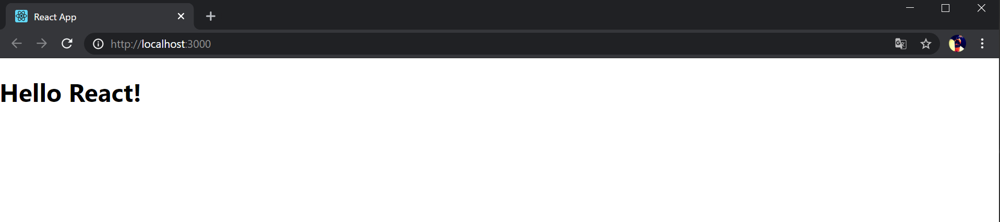
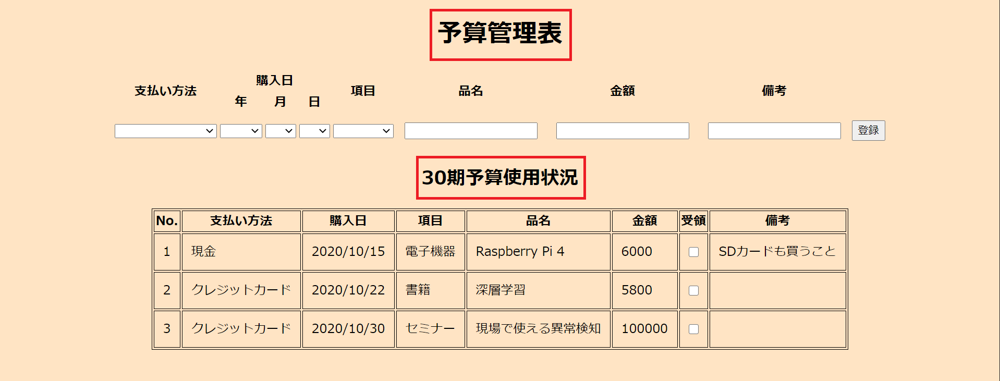

# プロジェクトの作成
新しいプロジェクトを作成します。
```bash
$ npx create-react-app budget-app
```
プロジェクト名は好きにつけて構いませんが<font color="red">大文字</font>は使えないので注意してください。

プロジェクトの作成が終わったら __src/__ 配下の __index.js__ 、 __index.css__ 以外のファイルを削除してください。

__index.js__ に次のコードを貼り付けます。

```javascript
import React from 'react'
import ReactDOM from 'react-dom'
import './index.css'

ReactDOM.render(<App />,document.getElementById('root'))
```

# 初期コードの解説
貼り付けたコードを詳しく見てみます。

次のコードはアプリケーションで使う外部モジュールを読み込んでいます。

```javascript
import React from 'react'
import ReactDOM from 'react-dom'
```

pythonでは次のようなコードにあたります。
```python
from kivy.app import App
```

次のコードは外部のcssファイルを読み込んでいます。
```javascript
import './index.css'
```

最終行はアプリケーションの実行を行うコードです。
```javascript
ReactDOM.render(<App />,document.getElementById('root'))
```

python(kivy)では次のようなコードにあたります。
```python
from kivy.app import App

class myApp(App):
    ...

app = myApp()
app.run()
```

# 初期コードを完成させる
初期のコードには未完成の部分があり、実行しても動作しません。

次の行に注目してみます。
```js
ReactDOM.render(<App />,document.getElementById('root'))
```

初期コードには\<App />にあたる部分の定義がありません。

\<App />の定義をし、初期コードを完成させます。

\<App />の定義を次のように追加しましょう。
```js
import React from 'react'
import ReactDOM from 'react-dom'
import './index.css'

const App = () => <h1>Hello React!</h1> //追加

ReactDOM.render(<App />,document.getElementById('root'))
```

これで初期コードが完成しました。
次のコマンドで実際に動くことを確認しましょう。

コマンドを実行する前にカレントディレクトリをプロジェクトのrootに変更するこを忘れないでください。
```
$ cd budget-app
$ npm start
```

http://localhost:3000 にアクセスして次のように表示されれば成功です。



# コンポーネント
Reactはコンポーネントと呼ばれる小さな部品を組み合わせてアプリケーション作るように設計されています。

Reactコンポーネントは次のように定義することができます。
```javascript
const App = () => <h1>Hello React!</h1>
```
Reactコンポーネントは関数としてもクラスとしても定義することができますが、クラスとして定義する方法は非推奨となっているので注意が必要です。

どちらで定義するにしても次のようにReactをインポートする必要があります。

```javascript
import React from 'react'
```

Reactコンポーネントは必ず __大文字__ で始まります。

# アロー関数
アロー関数は関数を短く記述するために導入されたjavascriptの構文です。

Reactにおいても(サンプルコードを見る限り)ほとんどの関数定義に用いられています。

```javascript
//基本の形
(param1, param2, …, paramN) => { statements }

//例
const sum => (a, b, c) {
    return a + b + c
}

//引数が一つの場合()を省略できる
singleParam => { statements }

//例
const print => str {
    console.log(str)
}

//引数が0の時
() => { statements }

//例
const hello => () {
    console.log(''hello)
}

//関数本体が1行の場合{}を省略できる

//例
const App = () => <h1>Hello React!</h1>
```

# 見出しの追加
アプリケーションに見出しを追加しましょう。

次の画像の赤く囲われた部分を実装します。



それぞれの見出しは __\<h1>__ 要素として表現します。

Appコンポーネントを次のように変更します。
```javascript
const App = () => {
    return (
        <div>
            <h1>
                予算管理表
            </h1>

            <h1>
                30期予算使用状況
            </h1>
        </div>
    )
}
```
アプリケーションを起動して次のようになっていれば成功です

