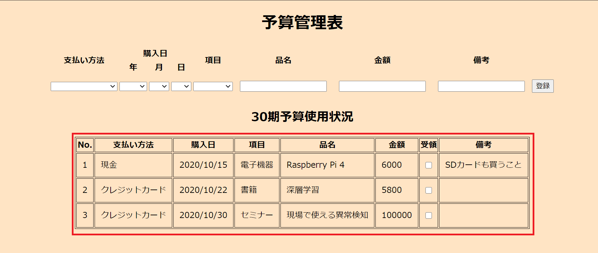
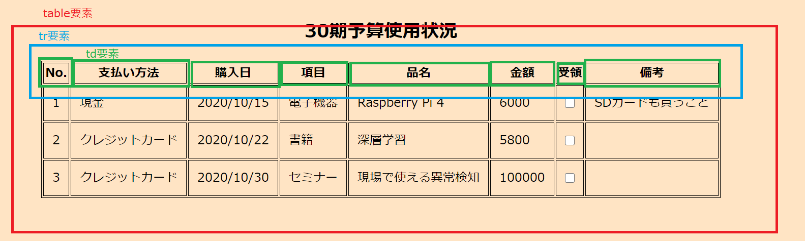
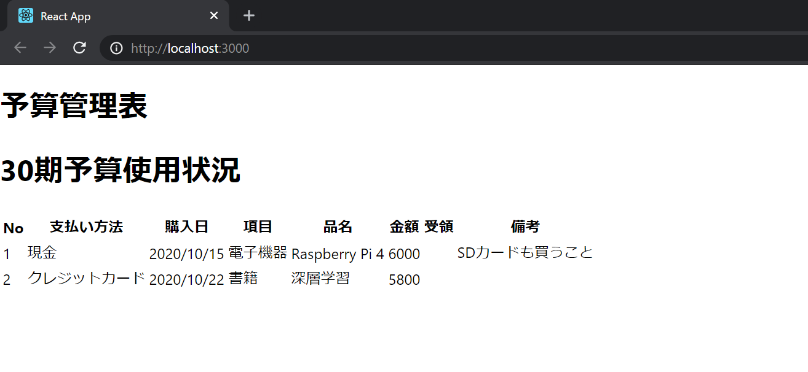

# 今回のゴール地点
今回は予算使用状況の表示を実装します。



# table
今回は予算使用状況の表示をHTMLのtableとして表現します。

HTMLではtable全体を __\<table>__ タグ、行を __\<tr>__ タグ、個々の要素を __\<td>__ タグ(見出しの場合は __\<th>__ タグ)を用いて表現します。



# オブジェクト
javascriptの世界ではオブジェクトと呼ばれるデータ構造が頻繁に用いられます。

オブジェクトは連想配列のようなもので次のような構造を持ちます
```javascript
obj = {key: value}
```

オブジェクトは次のように定義、操作します。
```javascript
//空のオブジェクトの定義
obj = {}
//オブジェクトの初期化
obj = {
    No: 1234,
    Type: "parson"
}
//keyを使ってvalueにアクセスする
obj.No
// >> 1234
obj["No"]
// >> 1234

// 新しい要素の追加
obj["age"] = 24
obj.age = 24
```
# 見出しデータの定義
tableの見出しに使うデータを定義します
```javascript
const App = () => {


    const title = {
        No: "No",
        pay: "支払い方法",
        date: "購入日",
        category: "項目",
        name: "品名",
        price: "金額",
        arrive: "受領",
        mome: "備考"
    }
...略
```

# コンテンツデータの定義
コンテンツとなるデータをハードコーディングすることは好ましくないですが、今回は簡単のためにハードコーディングしていきます。

後にバックエンドサーバからデータを取得できるよう改造を行います。
```javascript
const App {
    const title = {...}

    const content = [
        {
            No: 1,
            pay: "現金",
            date: "2020/10/15",
            category: "電子機器",
            name: "Raspberry Pi 4",
            price: 6000,
            arrive: false,
            mome: "SDカードも買うこと"
        },
        {
            No: 2,
            pay: "クレジットカード",
            date: "2020/10/22",
            category: "書籍",
            name: "深層学習",
            price: 5800,
            arrive: false,
            mome: ""
        }
    ]
...略
```
# 見出しの表示
アプリケーションに見出しを追加してみます。

先ずは　__\<table>__ タグを配置します。

```javascript
const App = () => {
    ...略
    return (
        <div>
            <h1>
                予算管理表
            </h1>

            <h1>
                30期予算使用状況
            </h1>
            <table></table> //追加
        </div>
    )
}

```

次に __\<tr>__ タグと __\<th>__ タグを使って見出しを表示します。
```javascript
const App = () => {

    ...略
    return (
        <div>
            <h1>
                予算管理表
            </h1>

            <h1>
                30期予算使用状況
            </h1>
            <table>
            //追加
                <tr>
                    <th>{title.No}</th>
                    <th>{title.pay}</th>
                    <th>{title.date}</th>
                    <th>{title.category}</th>
                    <th>{title.name}</th>
                    <th>{title.price}</th>
                    <th>{title.arrive}</th>
                    <th>{title.mome}</th>
                </tr>
            //追加ここまで
            </table>
        </div>
    )
}
```
# コンテンツの表示
次にコンテンツを追加します。

今回はコンテンツを __\<tr>__ タグと __\<td>__ タグで表現します。

先ほど2件分のコンテンツを定義したので __\<tr>__ タグを二つ使います。

```javascript
const App = () => {


    const title = {
        No: "No",
        pay: "支払い方法",
        date: "購入日",
        category: "項目",
        name: "品名",
        price: "金額",
        arrive: "受領",
        mome: "備考"
    }

    const content = [
        {
            No: 1,
            pay: "現金",
            date: "2020/10/15",
            category: "電子機器",
            name: "Raspberry Pi 4",
            price: 6000,
            arrive: false,
            mome: "SDカードも買うこと"
        },
        {
            No: 2,
            pay: "クレジットカード",
            date: "2020/10/22",
            category: "書籍",
            name: "深層学習",
            price: 5800,
            arrive: false,
            mome: ""
        }
    ]

    return (
        <div>
            <h1>
                予算管理表
            </h1>

            <h1>
                30期予算使用状況
            </h1>
            <table>
                <tr>
                    <th>{title.No}</th>
                    <th>{title.pay}</th>
                    <th>{title.date}</th>
                    <th>{title.category}</th>
                    <th>{title.name}</th>
                    <th>{title.price}</th>
                    <th>{title.arrive}</th>
                    <th>{title.mome}</th>
                </tr>
                //追加
                //1件目
                <tr>
                    <td>{content[0].No}</td>
                    <td>{content[0].pay}</td>
                    <td>{content[0].date}</td>
                    <td>{content[0].category}</td>
                    <td>{content[0].name}</td>
                    <td>{content[0].price}</td>
                    <td>{content[0].arrive}</td>
                    <td>{content[0].mome}</td>
                </tr>
                //2件目
                <tr>
                    <td>{content[1].No}</td>
                    <td>{content[1].pay}</td>
                    <td>{content[1].date}</td>
                    <td>{content[1].category}</td>
                    <td>{content[1].name}</td>
                    <td>{content[1].price}</td>
                    <td>{content[1].arrive}</td>
                    <td>{content[1].mome}</td>
                </tr>
                //追加ここまで
            </table>
        </div>
    )
}

```
# 表示の確認
プログラムを実行して次のような表示が出ればOKです。
