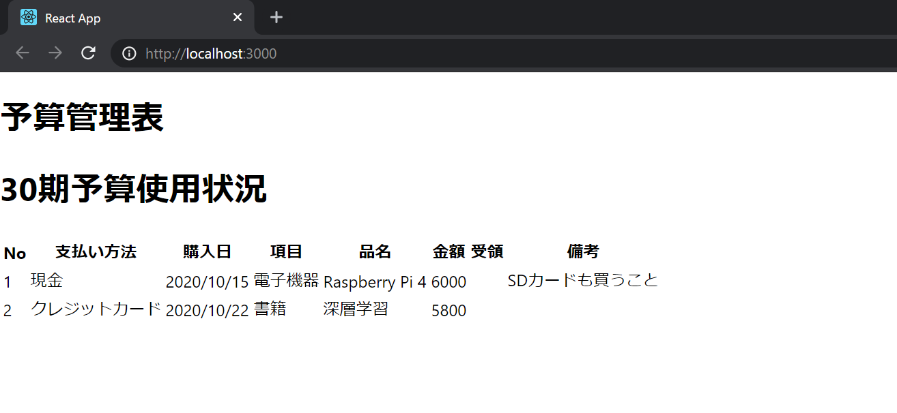
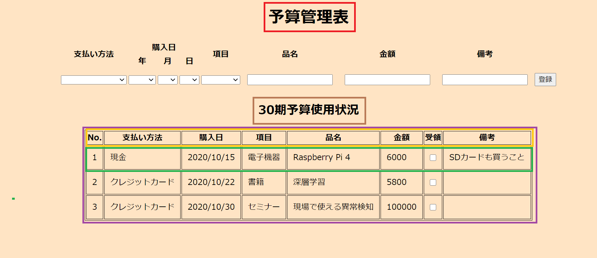

# 今回のゴール地点
前回は予算使用状況の表示を実装しました。

画面は次のようになっているはずです。



今回はリファクタリングを行っていきます。

リファクタリングとはプログラムの動作を変更することなく内部のコードを変更することです。

前回までのコードには重複やコピペなど良くない部分が多く含まれています。

今後の拡張に向けてリファクタリングを行い、内部設計を整理しておきます。

また、現状すべてのコードが __index.js__ に納められています。

適切な粒度のコンポーネント群へと分割することでこれも解消していきます。

# 重複の除去
まずはコードに含まれる重複を除去します。
具体的には以下の部分を直していきます。
```js
・・・略
    <tr>
        <td>{content[0].No}</td>
        <td>{content[0].pay}</td>
        <td>{content[0].date}</td>
        <td>{content[0].category}</td>
        <td>{content[0].name}</td>
        <td>{content[0].price}</td>
        <td>{content[0].arrive}</td>
        <td>{content[0].mome}</td>
    </tr>
    <tr>
        <td>{content[1].No}</td>
        <td>{content[1].pay}</td>
        <td>{content[1].date}</td>
        <td>{content[1].category}</td>
        <td>{content[1].name}</td>
        <td>{content[1].price}</td>
        <td>{content[1].arrive}</td>
        <td>{content[1].mome}</td>
        </tr>
    </table>
・・・略

```
この部分では配列の異なるインデックスの要素に対して同じ処理を適用していますが、個々の処理がハードコーディングされており重複してしまっています。また、このままだと動的に配列の長さが代わる場合に対応できないため、配列の長さ分だけ処理を反復するロジックへと置き換えます。
```js
・・・略
{content.map(content => {
    return (
        <tr>
            <td>{content.No}</td>
            <td>{content.pay}</td>
            <td>{content.date}</td>
            <td>{content.category}</td>
            <td>{content.name}</td>
            <td>{content.price}</td>
            <td>{content.arrive}</td>
            <td>{content.mome}</td>
        </tr>
    )
})}
</table>
・・・略
```
javascriptにおいて配列を反復処理するAPIはいくつかありますが今回はmap関数を使います。map関数は繰り返し処理を行う関数を引数とし、引数に渡された関数を配列の各要素に適用し、その結果が納められた新しい配列を返します。
# コンポーネントの分割
次にコンポーネントの分割をしていきます

分割は以下の色分けのようにしていきます



__src__ 配下に __App.js__ を作成し次のコードを記述します。
```js
import React from 'react'

const App = () => {
    return (
        <div>
            <Title />
            <ContentTitle />
            <ContentTable />
        </div>
    )
}

export default App
```
__App.js__ ではAppコンポーネントの定義を行っています。AppコンポーネントはTitle、ContentTitle、ContentTableの3つのコンポーネントを描画する責任を負っています。

次にこれらのコンポーネントを実装していきます。

まずはTitleコンポーネントです。

このコンポーネントは「予算管理表」という見出しを表示します

__src__ 配下に __component__ ディレクトリを作成しその下に __Title.js__ を作成します。
```js
import React from 'react'

const Title = () => {
    return (
        <h1>予算管理表</h1>
    )
}

export default Title
```

次にContentTitleコンポーネントを実装します。

__component__ 配下に __ContentTitle.js__ を作成します。
```js
import React from 'react'

const ContentTitle = () => {
    return (
        <h1>30期予算使用状況</h1>
    )
}

export default ContentTitle
```
ContentTableコンポーネントの実装に移ります。

__component__ 配下に __ContentTable.js__ を作成します。

ContentTableコンポーネントはtableの見出しとデータを表示するコンポーネントです。ContentTable自体は見出しを表示するコンポーネントとデータを表示するコンポーネントを持ち、実際の表示はそれぞれのコンポーネントが行います。

次のようにContentTableコンポーネントを実装します。

```js
import React from 'react'

const title = {
    No: "No",
    pay: "支払い方法",
    date: "購入日",
    category: "項目",
    name: "品名",
    price: "金額",
    arrive: "受領",
    mome: "備考"
}

const contents = [
    {
        No: 1,
        pay: "現金",
        date: "2020/10/15",
        category: "電子機器",
        name: "Raspberry Pi 4",
        price: 6000,
        arrive: false,
        mome: "SDカードも買うこと"
    },
    {
        No: 2,
        pay: "クレジットカード",
        date: "2020/10/22",
        category: "書籍",
        name: "深層学習",
        price: 5800,
        arrive: false,
        mome: ""
    }
]

const ContentTable = () => {
    return (
        <table>
            <TableTitles titles={titles}/>
            {contents.map(content => {
                return <TableData content={content} />
            })}
        </table>
    )
}

export default ContentTable
```
tableの見出しを表示するTableTitlesコンポーネントを実装します.

__component__ 配下に __TableTitles.js__ を作成します。
```js
import React from 'react'

const TableTitles = (props) => {
    return (
        <tr>
            <th>{props.titles.No}</th>
            <th>{props.titles.pay}</th>
            <th>{props.titles.date}</th>
            <th>{props.titles.category}</th>
            <th>{props.titles.name}</th>
            <th>{props.titles.price}</th>
            <th>{props.titles.arrive}</th>
            <th>{props.titles.mome}</th>
        </tr>
    )
}

export default TableTitles
```

tableのデータ部分を表示するTableDataコンポーネントを実装します。

__component__ 配下に __TableData.js__ を作成します。
```js
import React from 'react'

const TableData = (props) => {
    return (
        <tr>
        <td>{props.content.No}</td>
        <td>{props.content.pay}</td>
        <td>{props.content.date}</td>
        <td>{props.content.category}</td>
        <td>{props.content.name}</td>
        <td>{props.content.price}</td>
        <td>{props.content.arrive}</td>
        <td>{props.content.mome}</td>
    </tr>
    )
}

export default TableData
```
これで必要なコンポーネントは全て揃いました。__COntentTable.js__ 、 __App.js__ の先頭でそれぞれが必要な子コンポーネントのインポートを行います。

__ContentTable.js__
```js
import React from 'react'
import TableTitles from './TableTitles' // 追加
import TableData from './TableData' // 追加
```
__App.js__
```js
import React from 'react'
// 以下追加
import Title from './component/Title' 
import ContentTitle from './component/ContentTitle'
import ContentTable from './component/ContentTable'
```
最後に __index.js__ を書き換えます
```js
import React from 'react'
import ReactDOM from 'react-dom'
import './index.css'
import App from './App'

ReactDOM.render(<App />,document.getElementById('root'))
```
実行して次のようになればOKです。


# props
Reactには親コンポーネントから子コンポーネントへとデータを受け渡しするための __props__ という仕組みが存在します。

実際にpropsを使っている場面を見てみます。

__ContentTable.js__
```js
import React from 'react'
//・・・略//
const ContentTable = () => {
    return (
        <table>
            <TableTitles titles={titles}/>
            {contents.map(content => {
                return <TableData content={content} />
            })}
        </table>
    )
}

export default ContentTable
```
ここでは子コンポーネントであるTableTitles、contentsにデータを渡しています。

親コンポーネントから子コンポーネントへのデータの受け渡しは次のように行います。

プロパティ名は任意に設定することができます。
```js
<子コンポーネント名 プロパティ名=渡すデータ />
```
次に子コンポーネント側で親コンポーネントから渡されたデータへアクセスしている場面を見てみます。

__TableTitles.js__
```js
import React from 'react'

const TableTitles = (props) => {
    return (
        <tr>
            <th>{props.titles.No}</th>
            <th>{props.titles.pay}</th>
            <th>{props.titles.date}</th>
            <th>{props.titles.category}</th>
            <th>{props.titles.name}</th>
            <th>{props.titles.price}</th>
            <th>{props.titles.arrive}</th>
            <th>{props.titles.mome}</th>
        </tr>
    )
}

export default TableTitles
```

親コンポーネントからデータを受け取るためにはコンポーネントの定義の際に __props__ を引数を設定します。
```js
//・・・略
const TableTitles = (props) => {}
//・・・略 
```
データへのアクセスは次のように行います。
```js
props.プロパティ名
```
## propsを展開する
親コンポーネントからのデータへアクセスするのにいちいち __props__ を経由するのは面倒です。

コンポーネントの定義の際に次のように引数を設定することで、直接プロパティにアクセスすることができるようになります。
```js
const TableTitles = ({ プロパティ名 }) => {}
```
この記法を使って __TableData.js__ 、__TableTitles.js__ を書き換えます。

__TableData.js__
```js
import React from 'react'

const TableData = ({ content }) => {
    return (
        <tr>
        <td>{content.No}</td>
        <td>{content.pay}</td>
        <td>{content.date}</td>
        <td>{content.category}</td>
        <td>{content.name}</td>
        <td>{content.price}</td>
        <td>{content.arrive}</td>
        <td>{content.mome}</td>
    </tr>
    )
}

export default TableData
```

__TableTitles.js__
```js
import React from 'react'

const TableTitles = ({ titles }) => {
    return (
        <tr>
            <th>{titles.No}</th>
            <th>{titles.pay}</th>
            <th>{titles.date}</th>
            <th>{titles.category}</th>
            <th>{titles.name}</th>
            <th>{titles.price}</th>
            <th>{titles.arrive}</th>
            <th>{titles.mome}</th>
        </tr>
    )
}

export default TableTitles
```
実行して次のようになればOKです。

